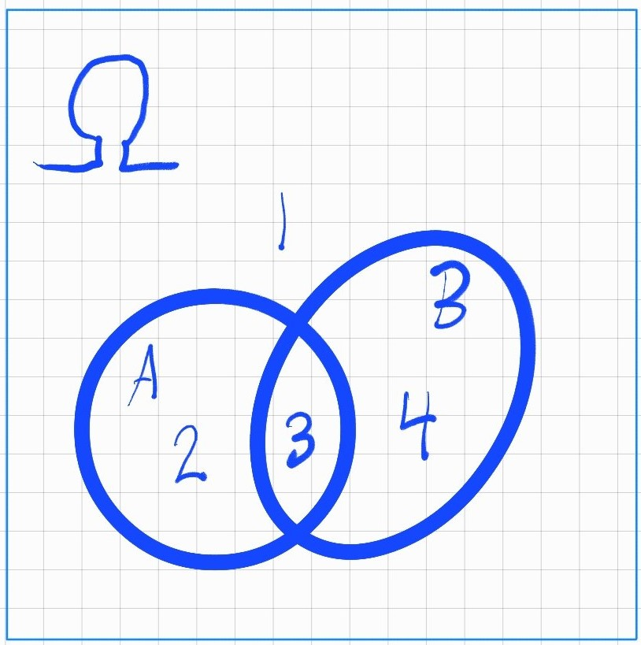

<!-- <link rel="stylesheet" type="text/css" href="static/blog.css"> -->

# Basic probability theory, MT3001 module 1 / 15

## Introduction
Probability theory is the study of random phenomena. It is used in many fields, such as statistics, machine learning, and finance. It is also used in everyday life, for example when playing games of chance, or when estimating the risk of an event. The most classic example is the coin toss, closely followed by the dice roll.

When we toss a coin the result is either heads or tails. In the case of an ideal coin, the "random trail" of tossing the coin has an equal probability for both outcomes. Similarly, for a die roll of a fair dice we know that the probability for each outcome is 1/6. In the study of probability we dive deep into the mathematics of these random phenomena, how to model them, and how to calculate the probability of different events. To do this in precise terms we define words and concepts as tools for discussing and communicating about the subject.

This is the first of what I expect to be a 15 part series of my lecture & study notes from my university course in probability theory MT3001 at Stockholm University. This first module concerns basic concepts and definitions, needed for the rest of the course.

## The language of Probability theory
When talking about probabilities we will arm ourselves with the language of "set theory", it is a crucial tool for the study of probability. Feeling comfortable with the subject of set theory since before is useful but not necessary. I will try to explain the concepts as we go along.
<!-- , but if you feel that you need to brush up on the subject I recommend the following resources: -->

An experiment is a process that produces a randomized result. If our experiment is throwing a die, we then have the following: The result of throwing the die is called an **outcome**, the set of all possible outcomes is called the **sample space** and a subset of the sample space is called an **event**. We will use the following notation:

- **outcome** is the result of an experiment, denoted with a small letter, ex. $u_1$, $u_2$, $u_3$, ...
- **event** is the subset of the sample space, denoted with a capital letter, ex. $A$, $B$, $C$, ...
- **sample space** is the set of all possible outcomes of an experiment, denoted $\Omega$.

Adding numbers to our dice example, we have the sample space $\Omega = \{1,2,3,4,5,6\}$ containing all the possible events $u_1=1, u_2=2, u_3=3, u_4=4, u_5=5$ and $u_6=6$. And we could study some specific sub events like the chance of getting an even number, $A=\{2,4,6\}$, or the chance of getting a prime number, $B=\{2,3,5\}$. As it happens the probability of both $A$ and $B$ is 50%.

## Sample space
The sample space is the set of all possible outcomes of an experiment. It is denoted $\Omega$. And there are two types of sample spaces, discrete and continuous. A discrete sample space is a finite or countably infinite set, and all other kind of sample spaces are called continuous.

The coin toss and the dice roll are both examples of discrete sample spaces. Studying a problem like the temperature outside, would in reality require a continuous sample space. But in practice we can often approximate a continuous sample space with a discrete one. For example, we could divide the temperature into 10 degree intervals, and then we would have a discrete sample space.

Remember that continuous sample spaces exist, and expect more information about them in later modules. For starters, we focus on discrete sample spaces.

## Probability
Probability is a measure of how likely an event is to occur. It is a number between 0 and 1, where 0 means that the event is impossible, and 1 means that the event is certain.

## Probability space
A probability space is a triple $(\Omega, \mathcal{F}, P)$, where $\Omega$ is the sample space, $\mathcal{F}$ is the set of events, and $P$ is the probability measure. 

